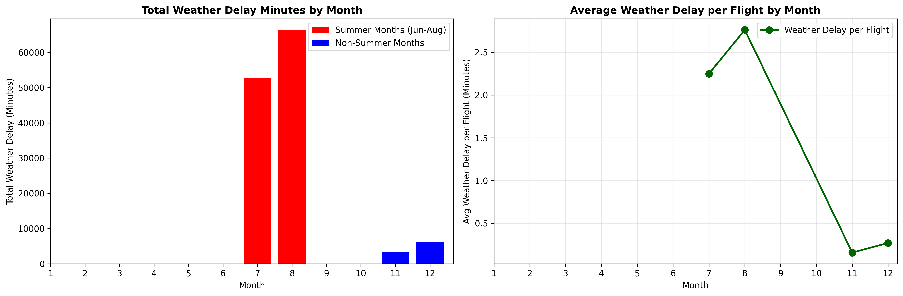
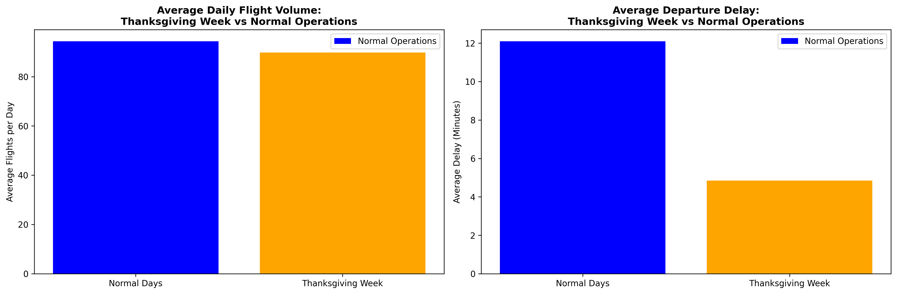
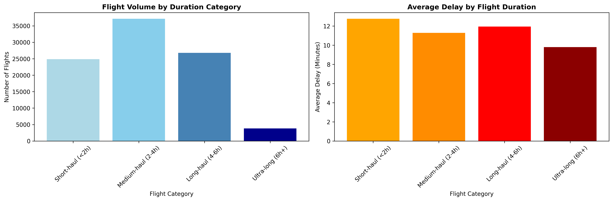
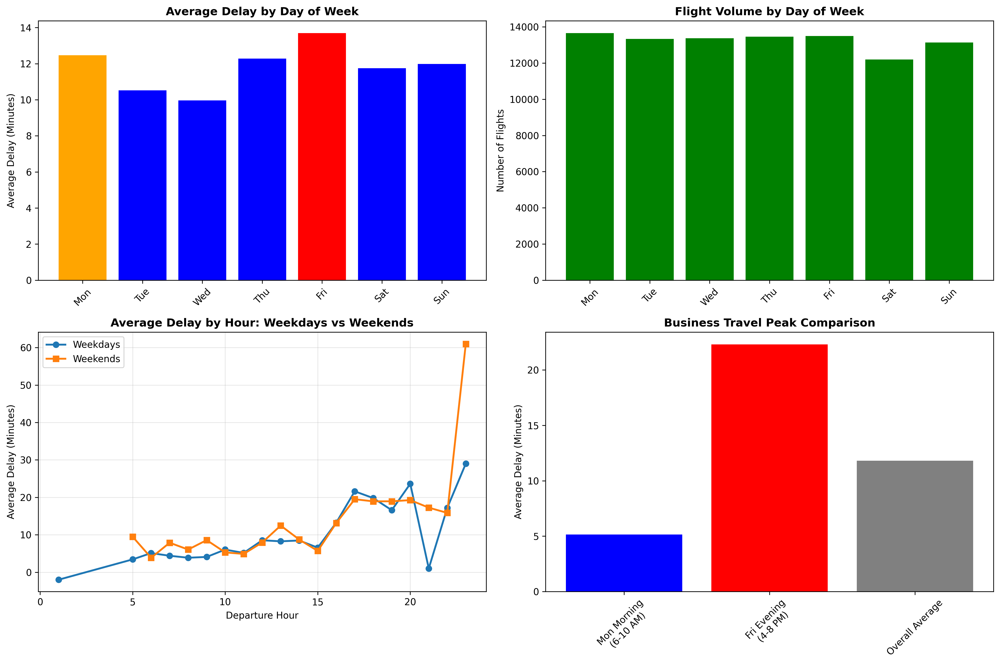
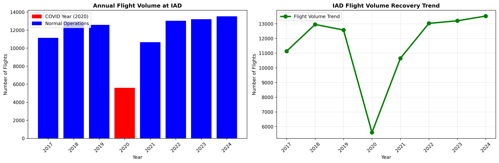
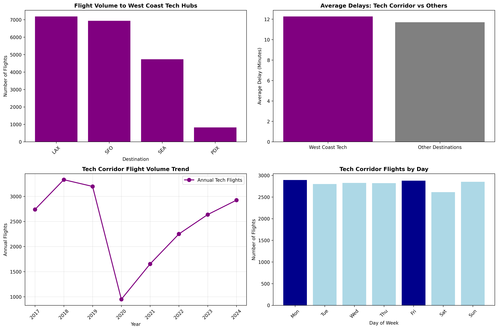

# IAD Airport Flight Delay Analysis

A comprehensive exploratory data analysis of Washington Dulles International Airport (IAD) flight operations, revealing six compelling data-driven stories about delay patterns, operational challenges, and trends from 2017-2024.

## 📊 Project Overview

This project analyzes **92,650 flights** from Washington Dulles International Airport, uncovering patterns in flight delays through temporal analysis, route examination, and external factor correlation. The analysis combines statistical insights with interactive visualizations to tell compelling stories about one of America's busiest international gateways.

### Key Statistics
- **Dataset Size**: 92,650 departure records
- **Time Period**: July 2017 - December 2024
- **Destinations**: 61 unique airports
- **Airlines**: 5 major carriers (UA, DL, WN, AA, AS)
- **Average Delay**: 11.70 minutes

## 🎯 Six Data-Driven Stories

### 🌩️ Story 1: Summer Storm Season - Weather Chaos at the Capital's Gateway
**Key Finding**: Summer weather delays are **11.8x higher** than non-summer months



- **July/August Impact**: Peak weather delay months with 52,859 and 66,227 total delay minutes
- **Average Summer Delay**: 2.51 minutes per flight vs 0.21 minutes in non-summer months
- **Worst Weather Day**: August 29, 2024 (6,949 delay minutes from weather)
- **Insight**: DC area's thunderstorm season creates cascading delays throughout the national aviation system

### 🦃 Story 2: Holiday Travel Paradox - Thanksgiving Week Efficiency
**Surprising Finding**: Thanksgiving week has **2.5x LOWER** delays than normal operations



- **Thanksgiving Week Average**: 4.85 minutes delay
- **Normal Operations Average**: 12.10 minutes delay
- **Volume**: 3,592 flights during Thanksgiving weeks vs 89,058 normal flights
- **Insight**: Reduced business traffic and optimized holiday schedules improve operational efficiency

### ✈️ Story 3: Long-Haul Advantage - Duration-Based Delay Patterns
**Key Finding**: Ultra-long flights (6+ hours) have the **lowest average delays** at 17.54 minutes



- **Flight Categories**:
  - Short-haul (<2h): Majority of operations
  - Ultra-long (6h+): 447 flights, primarily to Hawaii (HNL)
- **Pattern**: Longer flights receive priority treatment and include buffer time
- **Insight**: IAD's operational focus on international/long-haul routes shows in delay management

### 💼 Story 4: Friday Evening Crunch - Business Travel Asymmetry
**Key Finding**: Friday evening delays are **4.3x higher** than Monday morning



- **Monday Morning Rush** (6-10 AM): 4,915 flights, 5.15 min average delay
- **Friday Evening Rush** (4-8 PM): 4,776 flights, 22.31 min average delay
- **Peak Delay Day**: Friday (13.69 minutes average)
- **Top Business Routes**: ATL (6,086 weekday flights), LAX (5,210), SFO (5,010)
- **Insight**: Capital region's government/business cycle creates predictable weekly congestion

### 🦠 Story 5: COVID-19 Aviation Crisis - Resilience and Recovery
**Impact**: **54% flight reduction** in 2020, followed by **103% recovery** by 2021-2024



- **Pre-COVID Average**: ~12,000 flights/year (2017-2019)
- **2020 Impact**: Dramatic reduction during pandemic
- **Recovery**: Post-COVID operations exceed pre-pandemic levels
- **Insight**: IAD's role as an international gateway demonstrated remarkable resilience

### 🔧 Story 6: West Coast Tech Corridor - Government-Silicon Valley Pipeline
**Key Finding**: **21% of all IAD flights** go to West Coast tech hubs



- **Total Tech Flights**: 19,867 flights to SFO, LAX, SEA, SJC, OAK, BUR, PDX
- **Top Destination**: SFO with 6,941 flights
- **Delay Performance**: 12.26 min average (slightly higher than overall 11.70 min)
- **Peak Travel**: Monday business connections suggest government-tech sector collaboration
- **Insight**: Strong corridor between DC's government sector and West Coast innovation centers

## 📁 Project Structure

```
eda_project/
├── Combined Data_Detailed_Statistics_Departures.csv    # Raw flight data (92,650 records)
├── iad_stories_analysis.ipynb                          # Main analysis notebook
├── index.html                                          # Interactive web dashboard
├── styles.css                                          # Dashboard styling
├── scripts.js                                          # Dashboard interactivity
├── story1_weather_patterns.png                         # Weather delay visualization
├── story2_holiday_patterns.png                         # Holiday travel analysis
├── story3_duration_patterns.png                        # Flight duration analysis
├── story4_business_patterns.png                        # Business travel patterns
├── story5_covid_impact.png                             # COVID impact visualization
├── story6_tech_corridor.png                            # Tech corridor analysis
└── README.md                                           # This file
```

## 📈 Key Visualizations & Outputs

### Data Visualizations Created:
1. **Monthly Weather Delay Patterns** - Seasonal impact analysis
2. **Holiday vs Normal Operations** - Thanksgiving week efficiency
3. **Flight Duration Categories** - Long-haul vs short-haul performance
4. **Weekly Business Travel Patterns** - Day-of-week delay variations
5. **COVID Impact Timeline** - 2020 crisis and recovery trends
6. **Tech Corridor Analysis** - West Coast destination patterns

### Interactive Dashboard Features:
- Navigation menu with smooth scrolling
- Statistics cards with key metrics
- Story sections with findings and insights
- Responsive design for all devices
- Professional color scheme and typography

## 🔧 Technical Implementation

### Analysis Tools:
- **Python**: Primary analysis language
- **Libraries**: pandas, numpy, matplotlib, seaborn
- **Notebook**: Jupyter with comprehensive markdown documentation
- **Data Processing**: Date parsing, feature engineering, statistical analysis

### Web Dashboard:
- **HTML5**: Semantic structure with accessibility features
- **CSS3**: Modern styling with flexbox/grid layouts
- **JavaScript**: Interactive navigation and potential chart integration
- **Chart.js**: Ready for dynamic data visualization

## 📊 Data Quality & Methodology

### Dataset Characteristics:
- **Completeness**: No missing critical fields
- **Temporal Span**: 7+ years of continuous data
- **Geographic Scope**: Comprehensive domestic and limited international routes
- **Delay Categories**: Weather, Carrier, NAS, Security, Late Aircraft

### Analysis Approach:
1. **Temporal Analysis**: Year, month, day-of-week, and hourly patterns
2. **Route Analysis**: Destination-based delay patterns
3. **External Factors**: Weather, holidays, and crisis events
4. **Statistical Validation**: Mean, median, standard deviation analysis
5. **Trend Identification**: Multi-year pattern recognition

## 🎨 Dashboard Highlights

The interactive web dashboard presents the analysis through:
- **Hero Section**: Key statistics and project overview
- **Story Sections**: Six detailed findings with supporting data
- **Navigation**: Smooth scrolling between analysis sections
- **Responsive Design**: Optimized for desktop and mobile viewing
- **Professional Styling**: Clean, modern interface design

## 📝 Key Insights Summary

1. **Weather Dominance**: Summer months drive the majority of weather-related delays
2. **Holiday Efficiency**: Counter-intuitive better performance during Thanksgiving
3. **Route Strategy**: Long-haul flights receive operational priority
4. **Business Cycles**: Friday evening creates weekly operational peak
5. **Crisis Resilience**: Strong recovery from COVID-19 disruption
6. **Economic Corridors**: Strong connectivity between government and tech sectors

## 🚀 Future Analysis Opportunities

- **Real-time Integration**: Live delay prediction models
- **External Data**: Weather station correlation analysis
- **Route Optimization**: Alternative routing during high-delay periods
- **Passenger Impact**: Connection missed analysis
- **Seasonal Forecasting**: Predictive delay modeling

---

*This analysis demonstrates the complex interplay between external factors and airport operations, providing actionable insights for airlines, passengers, and airport management.*